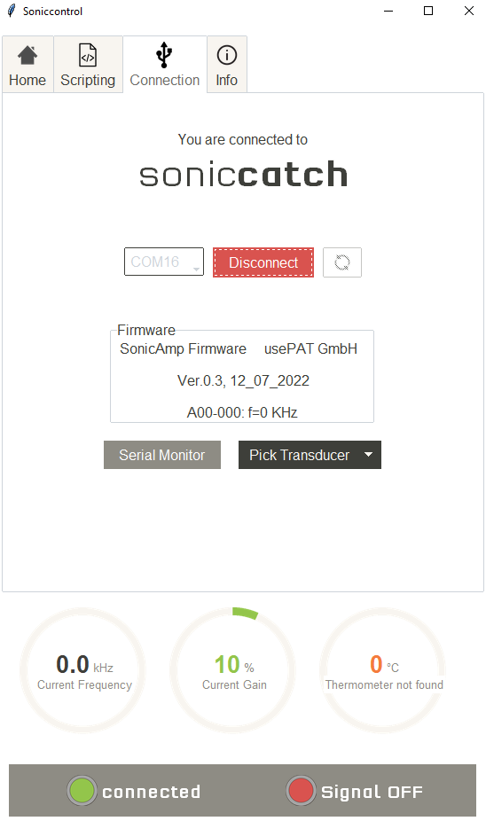
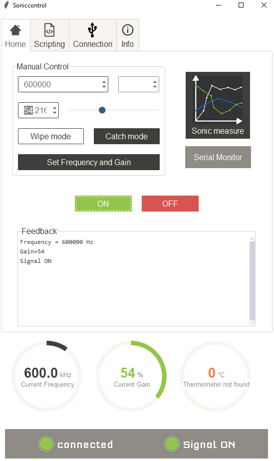
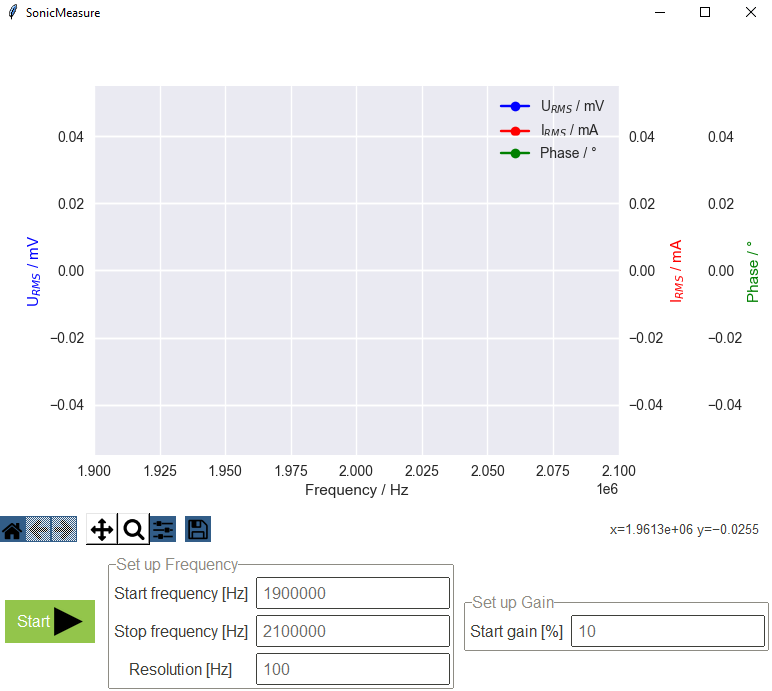
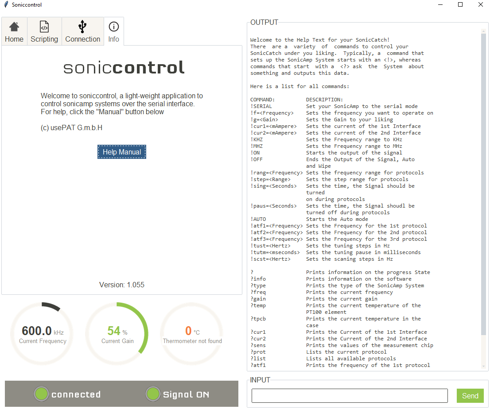

# SONICCONTROL

SonicControl is a python based light-weighted graphical user interface for controlling a SonicAmp. The GUI uses can be run on any platform and uses the serial interface to communicate with the device. Furthermore, SonicControl offers a simple scripting language to control a SonicAmp automatically for a certain duration.

## Installation

The installation of SonicControl is done by cloning the repository and installing the application while being in the folder through using the python package manager pip:
```bash
$ git clone https://github.com/usepat/soniccontrol.git
$ cd sonicontrol
$ python -m pip install -e .
```

## Update
To update soniccontrol, navigate to the cloned repository on your device and pull the new version. Proceed with installing the new souce code to the python path with using pip:
```bash
$ cd <path/to/soniccontrol>
$ git pull
$ python -m pip install -e .
```

#### Changing version
If you wish to change to a certain verison of the application, you can gladly do so by checking out the release and installing the source code to the python path using pip:
```bash
$ cd <path/to/soniccontrol>
$ git checkout <release tag>
$ python -m pip install -e .
```

## Usage
```bash
$ python -m soniccontrol
```

#### Connectiontab
The connection tab is the interface you are greeted with, here you can connect to a SonicAmp and inspect the already established connection.



#### Hometab
The home tab is the main interface to control a SonicAmp manually. Here you can set certain values and validate, that everything works fine. Additionally, here lies the button to take you to the SonicMeasure window or to open the Serial Monitor for configuring your SonicAmp through a command-line expirience.



#### SonicMeasure
The SonicMeasure window is used to collect data regarding the electrical signature of a SonicAmp through-out a certain time in a configured range of frequencies. Each data point that was collected is instantly being plotted.



#### Scriptingtab
The scripting tab is used to automate certain repetetive behaviours of a SonicAmp. The script language is relatively simple and easy-to-learn. There is a Scripting Helper, that shows the behaviour of each command. Nevertheless, here is a short documentation about this:

###### Commands:
- ```frequency <Hz>```
⋅⋅⋅Sets the frequency of a SonicAmp to the passed number, if it is possible
- ```gain <percent>```
  Sets the gain of a SonicAmp tp the passed number, if it is possible
- ```hold <seconds or milliseconds>```
  Holds the state of things for the passed amount of time. The time unit defaults to milliseconds, whereas if you pass the time unit explicitly, seconds can be used:
    ``hold 10s`` -> holds for 10 seconds
    ``hold 100ms`` -> holfs for 100 milliseconds
- ```on```
  Turns the SonicAmp ultrasound signal output to ON
- ```off```
  Turns the SonicAmp ultrasound signal output to OFF
- ```startloop <number>```
  Declares the beginning of a loop with the passed quantifier, that declares how much cycles should the loop have
- ```endloop```
  Declares the end of a loop, it is mandatory for every loop to have an ``endloop`` statement
- ```ramp <start Hz> <stop Hz> <resolution in Hz> <delay in s or ms>```
  Sets a certain range of frequencies to the SonicAmp, starts with the ``<start Hz>`` parameter, goes until the ``<stop Hz>`` parameter and goes in ``<resolution in Hz>`` big steps. Furthermore, it waits ``<delay in s or ms>`` between the settings of frequencies. The delay paramter behaves like a hold parameter, so the time unit can also be passed.


#### Infotab and Serial-Monitor
The infotab gives you access to a help page document for further help for the application and tells you the version of the SonicControl itself. Likewise, the Serial Monitor gives you a quick briefing about possible commands to configure your SonicAmp.


