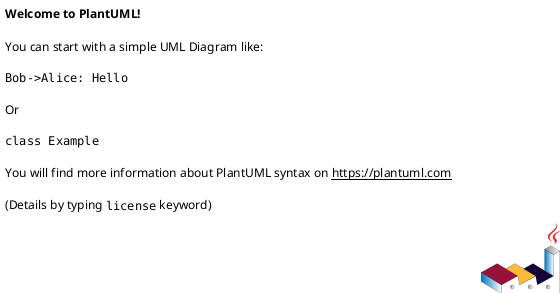

@defgroup Documentation
@ingroup ProjectSetup
@addtogroup Documentation
@{

# Documentation {#Documentation}

## Doxygen

For the generating the documentation [Doxygen](https://www.doxygen.nl/index.html) is used. 
It is a versatile tool, that supports documenting different languages like C++ and Python via docstrings.

```python
def foo(arg1, arg2):
    """!
    @brief This function performs a specific operation.

    @details This function takes two arguments and performs an operation on them. 
    The operation can be described in detail here. Additional context, 
    assumptions, or special cases can also be included in this section.

    @param arg1 This parameter represents the first input to the function. 
    It can be of type int, float, or string depending on the use case.
    
    @param arg2 This parameter is the second input to the function. It 
    complements the first parameter, and its type and purpose should 
    align with the function's requirements.

    @return The function returns a value that depends on the inputs.
    For example, it might return the sum of `arg1` and `arg2` if they 
    are both integers or floats, or it could return a concatenated string 
    if both inputs are strings.
    
    @exception ValueError If an invalid argument is passed, the function 
    may raise a ValueError with a descriptive error message.
    
    @see another_function()
    """
    # Example operation
    if isinstance(arg1, (int, float)) and isinstance(arg2, (int, float)):
        return arg1 + arg2
    elif isinstance(arg1, str) and isinstance(arg2, str):
        return arg1 + arg2
    else:
        raise ValueError("Invalid argument types: arg1 and arg2 must be either both numbers or both strings.")
```

To setup doxygen you have to create a DoxyFile with `doxygen -g ./path/DoxyFile`, 
that contains various options and tells doxygen how to generate the documentation. 
Then the documentation can be generated with `doxygen ./path/to/DoxyFile`. 
For that command a vscode task exists `Build Documentation`.
The generated documentation gets stored in `OUTPUT_DIR`, that is set to *docs/output*.
By opening *docs/output/html/index.html* in the browser you can view the documentation. 

Some important doxygen commands to remember are `@copydoc` and `@ref`.

Doxygen can incorporate Markdownd and PlantUML.  

## Markdown

[Markdown](https://www.markdownguide.org/getting-started/) compiles to normal html and is just a quick markup language for writing fast beautiful,
well structured documents.

In our Documentation Markdown is mainly used for writing the documentation pages about the 
project setup, project structure and high level overview over the project and the code.
We can reference pages with `@subpage` and can group them together with 
```doxygen
@defgroup Documentation
@ingroup ProjectSetup
@addtogroup Documentation
@{

# title {#title_anchor}

<!--Markdown text-->
    
@}
```


## PlantUML

[PlantUML](https://plantuml.com/) is a markup language for generating graphs and diagrams of many kinds.
It supports class, sequence, state, package, use cases diagrams and many more.

For generating the diagrams you need to install PlantUML and specify the `PLANTUML_JAR_PATH` as an environment variable. Then you can add diagrams directly in the doxygen comments via:

or 
```plantuml
@startuml
' preprocessor macro to include a puml file
!include path/to/diagram.puml 
@enduml
```
All puml-files need to lie inside *docs/diagrams*, because this is specified as a lookup path for doxygen with `PLANTUML_INCLUDE_PATH`.

@}